```python
import pandas as pd
import numpy as np
import matplotlib.pyplot as plt
import seaborn as sns
import json
import gc
import sys
import math

from pandas.io.json import json_normalize
from datetime import datetime
from sklearn import preprocessing

import os
```


```python
data1= pd.read_csv('df_EDA.csv')
```


```python
data1['SalePrice'].describe()
```


    count      1460.000000
    mean     180921.195890
    std       79442.502883
    min       34900.000000
    25%      129975.000000
    50%      163000.000000
    75%      214000.000000
    max      755000.000000
    Name: SalePrice, dtype: float64


```python
#Distribution plot of Sale Price

sns.distplot(data1['SalePrice']);
```

    C:\Users\veera\Anaconda3\lib\site-packages\matplotlib\axes\_axes.py:6462: UserWarning: The 'normed' kwarg is deprecated, and has been replaced by the 'density' kwarg.
      warnings.warn("The 'normed' kwarg is deprecated, and has been "
    


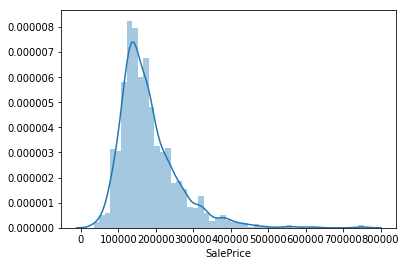


```python
print("Skewness: %f" % data1['SalePrice'].skew())
print("Kurtosis: %f" % data1['SalePrice'].kurt())
```

    Skewness: 1.882876
    Kurtosis: 6.536282
    


```python
#Histogram of Sale Price

plt.hist(data1['SalePrice'],orientation = 'vertical',histtype = 'bar', color ='red')
plt.show()
```


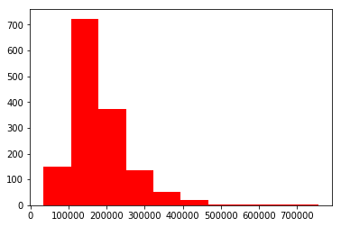


```python
#Correlation coefficients between numeric features and SalePrice
numeric_features = data1.select_dtypes(include=[np.number])
correlation = numeric_features.corr()
print(correlation['SalePrice'].sort_values(ascending = False),'\n')
```

    SalePrice        1.000000
    OverallQual      0.790982
    GrLivArea        0.708624
    GarageCars       0.640409
    GarageArea       0.623431
    TotalBsmtSF      0.613581
    1stFlrSF         0.605852
    FullBath         0.560664
    TotRmsAbvGrd     0.533723
    YearBuilt        0.522897
    YearRemodAdd     0.507101
    MasVnrArea       0.472614
    Fireplaces       0.466929
    BsmtFinSF1       0.386420
    WoodDeckSF       0.324413
    2ndFlrSF         0.319334
    OpenPorchSF      0.315856
    HalfBath         0.284108
    LotArea          0.263843
    GarageYrBlt      0.261366
    BsmtFullBath     0.227122
    BsmtUnfSF        0.214479
    LotFrontage      0.209624
    BedroomAbvGr     0.168213
    ScreenPorch      0.111447
    PoolArea         0.092404
    MoSold           0.046432
    3SsnPorch        0.044584
    BsmtFinSF2      -0.011378
    BsmtHalfBath    -0.016844
    MiscVal         -0.021190
    Id              -0.021917
    Unnamed: 0      -0.021917
    LowQualFinSF    -0.025606
    YrSold          -0.028923
    OverallCond     -0.077856
    MSSubClass      -0.084284
    EnclosedPorch   -0.128578
    KitchenAbvGr    -0.135907
    Name: SalePrice, dtype: float64 
    
    


```python
#Correlation Heat Map
f , ax = plt.subplots(figsize = (14,12))

plt.title('Correlation of Numeric Features with Sale Price',y=1,size=16)

sns.heatmap(correlation,square = True,  vmax=0.8)
```


    <matplotlib.axes._subplots.AxesSubplot at 0x1fc8e735dd8>


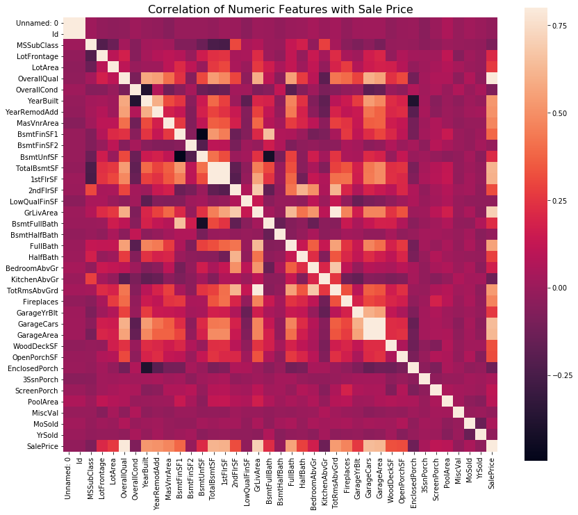


```python
k= 11
cols = correlation.nlargest(k,'SalePrice')['SalePrice'].index
print(cols)
cm = np.corrcoef(data1[cols].values.T)
f , ax = plt.subplots(figsize = (14,12))
sns.heatmap(cm, vmax=.8, linewidths=0.01,square=True,annot=True,cmap='viridis',
            linecolor="black",xticklabels = cols.values ,annot_kws = {'size':12},yticklabels = cols.values)
```

    Index(['SalePrice', 'OverallQual', 'GrLivArea', 'GarageCars', 'GarageArea',
           'TotalBsmtSF', '1stFlrSF', 'FullBath', 'TotRmsAbvGrd', 'YearBuilt',
           'YearRemodAdd'],
          dtype='object')
    


    <matplotlib.axes._subplots.AxesSubplot at 0x1fc8ec768d0>


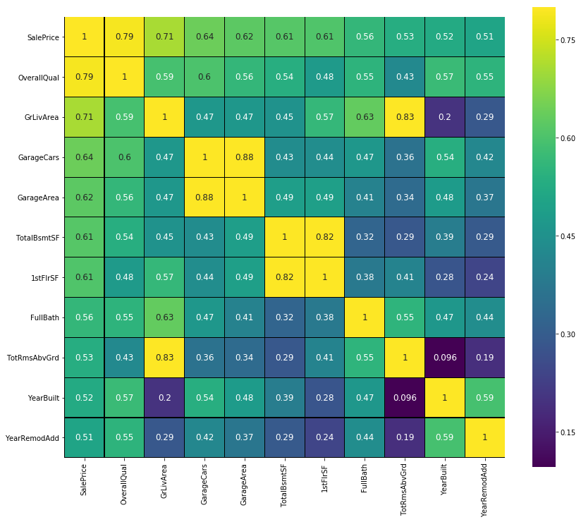


```python
#Scatter plots between the most correlated variables
fig, ((ax1, ax2), (ax3, ax4),(ax5,ax6)) = plt.subplots(nrows=3, ncols=2, figsize=(14,10))
OverallQual_scatter_plot = pd.concat([data1['SalePrice'],data1['OverallQual']],axis = 1)
sns.regplot(x='OverallQual',y = 'SalePrice',data = OverallQual_scatter_plot,scatter= True, fit_reg=True, ax=ax1)
TotalBsmtSF_scatter_plot = pd.concat([data1['SalePrice'],data1['TotalBsmtSF']],axis = 1)
sns.regplot(x='TotalBsmtSF',y = 'SalePrice',data = TotalBsmtSF_scatter_plot,scatter= True, fit_reg=True, ax=ax2)
GrLivArea_scatter_plot = pd.concat([data1['SalePrice'],data1['GrLivArea']],axis = 1)
sns.regplot(x='GrLivArea',y = 'SalePrice',data = GrLivArea_scatter_plot,scatter= True, fit_reg=True, ax=ax3)
GarageArea_scatter_plot = pd.concat([data1['SalePrice'],data1['GarageArea']],axis = 1)
sns.regplot(x='GarageArea',y = 'SalePrice',data = GarageArea_scatter_plot,scatter= True, fit_reg=True, ax=ax4)
FullBath_scatter_plot = pd.concat([data1['SalePrice'],data1['FullBath']],axis = 1)
sns.regplot(x='FullBath',y = 'SalePrice',data = FullBath_scatter_plot,scatter= True, fit_reg=True, ax=ax5)
YearBuilt_scatter_plot = pd.concat([data1['SalePrice'],data1['YearBuilt']],axis = 1)
sns.regplot(x='YearBuilt',y = 'SalePrice',data = YearBuilt_scatter_plot,scatter= True, fit_reg=True, ax=ax6)
YearRemodAdd_scatter_plot = pd.concat([data1['SalePrice'],data1['YearRemodAdd']],axis = 1)
YearRemodAdd_scatter_plot.plot.scatter('YearRemodAdd','SalePrice')

```


    <matplotlib.axes._subplots.AxesSubplot at 0x1fc8eb79ac8>


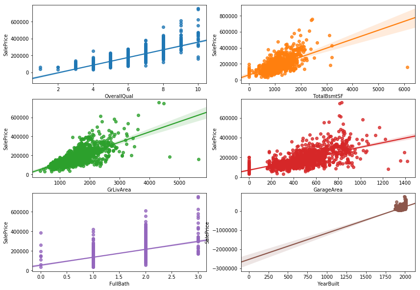


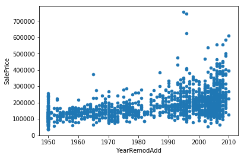


```python
var = 'Neighborhood'
data = pd.concat([data1['SalePrice'], data1[var]], axis=1)
f, ax = plt.subplots(figsize=(16, 10))
fig = sns.boxplot(x=var, y="SalePrice", data=data)
fig.axis(ymin=0, ymax=800000);
xt = plt.xticks(rotation=45)

plt.figure(figsize = (12, 6))
sns.countplot(x = 'Neighborhood', data = data)
xt = plt.xticks(rotation=45)
```


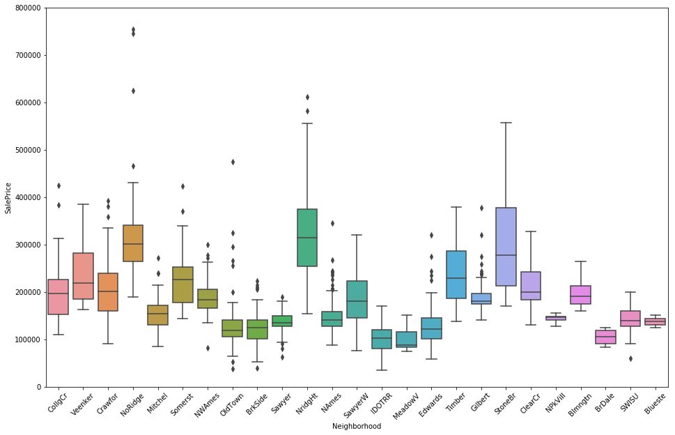


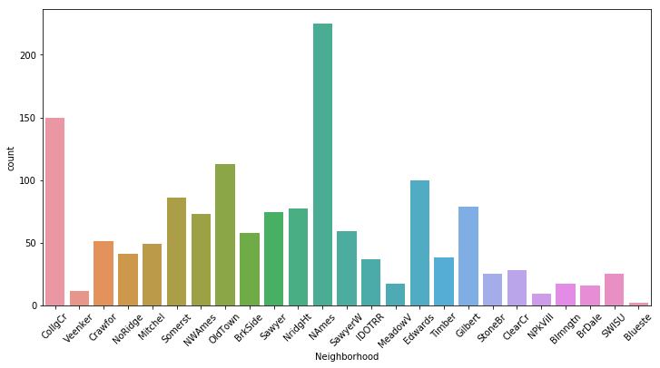


```python
var = 'SaleType'
data = pd.concat([data1['SalePrice'], data1[var]], axis=1)
f, ax = plt.subplots(figsize=(16, 10))
fig = sns.boxplot(x=var, y="SalePrice", data=data)
fig.axis(ymin=0, ymax=800000);
xt = plt.xticks(rotation=45)
var = 'SaleCondition'
data = pd.concat([data1['SalePrice'], data1[var]], axis=1)
f, ax = plt.subplots(figsize=(16, 10))
fig = sns.boxplot(x=var, y="SalePrice", data=data)
fig.axis(ymin=0, ymax=800000);
xt = plt.xticks(rotation=45)
```


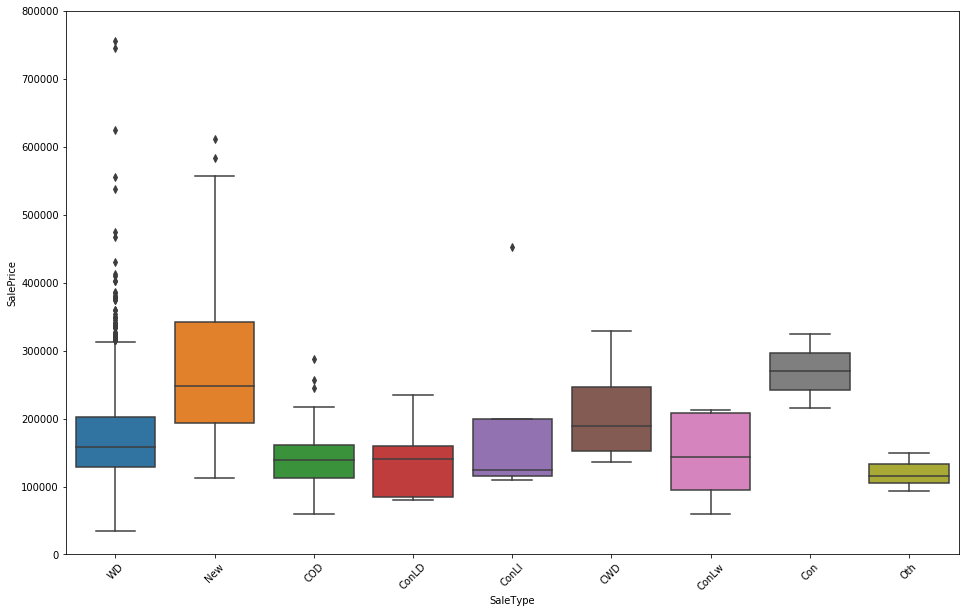


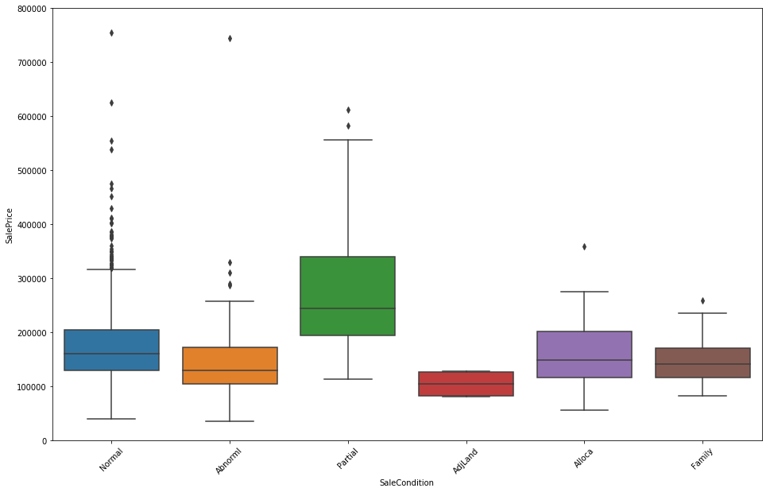


```python
sns.factorplot('FireplaceQu', 'SalePrice', data = data1, color = 'm', \
               estimator = np.median, order = ['Ex', 'Gd', 'TA', 'Fa', 'Po'], size = 4.5,  aspect=1.35)
```


    <seaborn.axisgrid.FacetGrid at 0x1fc8ef18128>


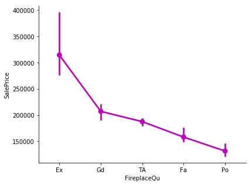


```python
categorical_features = data1.select_dtypes(include=[np.object])

for c in categorical_features:
    data1[c] = data1[c].astype('category')
    if data1[c].isnull().any():
        data1[c] = data1[c].cat.add_categories(['MISSING'])
        data1[c] = data1[c].fillna('MISSING')

def boxplot(x, y, **kwargs):
    sns.boxplot(x=x, y=y)
    x=plt.xticks(rotation=90)
f = pd.melt(data1, id_vars=['SalePrice'], value_vars=categorical_features)
g = sns.FacetGrid(f, col="variable",  col_wrap=2, sharex=False, sharey=False, size=5)
g = g.map(boxplot, "value", "SalePrice")
```


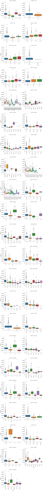

